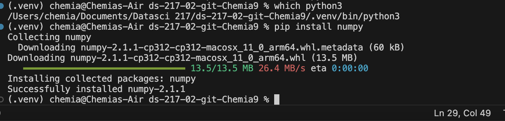

# Contents of assignment 1

## My solution to the sum problem is:
```
sum = 0
for i in range(1000):
   if (i % 3 == 0) | (i % 5 == 0):
       sum = sum + i
print(sum)
```
And the result that it produced was **233168**

## About me:

I'm a recent medical graduate from Iran. I'm also a math enthusiast, and I'm excited to expand my programming foundations and skills and to apply them in solving health challenges.

## link to python official website:
[python site](https://www.python.org)

## screenshot of numpy installation



## Meme


